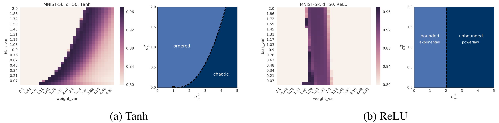
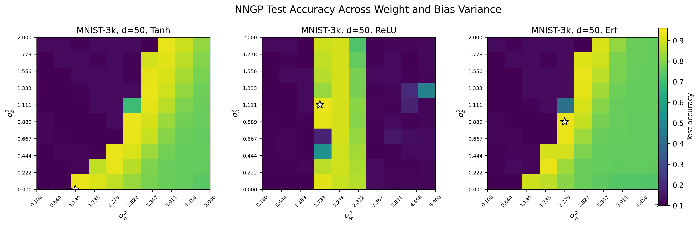

Repo URL - https://github.com/AnJiCU28/nngp-project.git

# NNGP Phase Diagram Reproduction with Erf Extension

This project reproduces the phase-diagram experiment from Figure 4 of Lee et al., *Deep Neural Networks as Gaussian Processes* (ICLR 2018), using the authors' original `brain-research/nngp` codebase.

The project evaluates NNGP classification accuracy across different weight and bias variances. The original Tanh and ReLU nonlinearities are reproduced, and the project is extended by adding the error-function (Erf) nonlinearity.

---

### Original vs. Reproduction

| Original Figure 4 | Reproduction |
| --- | --- |
|  |  |
| Lee et al. Figure 4 | Tanh, ReLU, and Erf results from this project |

The reproduction shows the same general structure as the paper. Tanh produces a diagonal region of high accuracy as weight and bias variance change, while ReLU produces a narrower high-accuracy region primarily controlled by weight variance. The third panel shows the Erf extension which shows similarities to Tanh.

---

## Reproducing the Project

### Requirements

- Git
- Docker

The Docker image uses TensorFlow 1.15 so that the original NNGP code can run in a compatible environment.

### 1. Clone the repository

```bash
git clone https://github.com/AnJiCU28/nngp-project.git
cd nngp-project
```

### 2. Build the Docker image

```bash
docker build --platform linux/amd64 -t nngp-project .
```

### 3. Run the project

#### macOS / Linux

```bash
docker run --platform linux/amd64 \
  -v "$(pwd)/output":/nngp/output \
  nngp-project
```

#### Windows using Git Bash

Git Bash performs automatic path conversion that can interfere with the Linux container path `/nngp/output`. Disable that conversion with:

```bash
MSYS_NO_PATHCONV=1 docker run --platform linux/amd64 \
  -v "$(pwd)/output":/nngp/output \
  nngp-project
```

The repository already contains an `output` directory, so it does not need to be created manually.

After the container finishes, the following files are written to `output/`:

```text
demo_phase_grid.csv
demo_phase_diagram.png
phase_diagram_three_panel.png
```

`demo_phase_grid.csv` and `demo_phase_diagram.png` are generated from a small set of fresh NNGP calculations performed when the container runs. These files demonstrate that the experiment and plotting pipeline works from a clean clone.

`phase_diagram_three_panel.png` is the final project figure. It is regenerated from the full experimental CSV files `phase_grid_mnist3k_10x10.csv` (generated using Tanh and ReLU) and `phase_grid_erf_mnist3k_10x10.csv` (generated using Erf), which are included in the repository in directory `data/`.

---

## Experiment Setup

The main reproduction uses:

- Dataset: MNIST
- Training examples: 3,000
- Evaluation examples: 1,000
- Network depth: 50
- Weight variance range: 0.1 to 5.0
- Bias variance range: 0.0 to 2.0
- Hyperparameter grid: 10 x 10
- Nonlinearities: Tanh, ReLU, and Erf

The full Tanh and ReLU experiments use the original numerical lookup-grid settings:

```text
n_gauss = 501
n_var   = 501
n_corr  = 500
```

The Erf experiment uses:

```text
n_gauss = 201
n_var   = 201
n_corr  = 200
```

The smaller Erf lookup grid was necessary to keep numerical grid generation within the available memory.

---

## Unique Extension: Erf Nonlinearity

The original Figure 4 compares the behavior of Tanh and ReLU NNGP kernels as weight and bias variance change. This project compares a third error-function activation, `phi(x) = erf(x)`, and repeats the same phase-grid experiment. I chose Erf because it is a bounded, smooth nonlinearity like Tanh, but it has a different functional form. This makes it useful for testing whether the structure visible in the Tanh phase diagram is specific to Tanh or is also present for another smooth bounded activation.

The original NNGP implementation supports numerical evaluation of kernel recursions for pointwise nonlinearities. I added Erf to `run_experiments.py` using TensorFlow's error-function operation and allowed the existing numerical interpolation-grid code to construct the corresponding NNGP kernel. The experimental procedure was otherwise kept the same as the Tanh and ReLU runs: depth 50, MNIST-3k, and a 10 x 10 sweep over weight and bias variance.

The Erf results show a clear diagonal region of high test accuracy. This behavior is qualitatively more similar to Tanh than to ReLU. As bias variance increases, the weight variance associated with the best-performing region also tends to increase. The location and width of this region are not identical to Tanh, showing that the choice of smooth nonlinearity changes where strong NNGP performance occurs even when the overall phase-diagram structure is similar.

The best observed Erf test accuracy in the grid was approximately 0.934, which was comparable to the strongest Tanh and ReLU results in this experiment. The main result of the extension is therefore not that Erf produces substantially higher accuracy, but that another bounded smooth activation produces a similar diagonal high-performance region while shifting its location in hyperparameter space.

Because generating the original 501 x 501 x 500 numerical interpolation grid for Erf exceeded available memory, the Erf kernel was generated using a 201 x 201 x 200 lookup grid. This is sufficient for the extension experiment but is an additional approximation relative to the original Tanh and ReLU calculations.  

---

## Deviations and Limitations

The reproduction does not exactly match the computational scale used in the original paper.

The main differences are:

- **Training-set size:** The paper's Figure 4 used MNIST-5k. This project uses MNIST-3k because the 5,000-example covariance calculation exceeded the available Docker memory.
- **Hyperparameter resolution:** The paper used a 30 x 30 grid, or 900 hyperparameter combinations per nonlinearity. This project uses a 10 x 10 grid, or 100 combinations per nonlinearity to reduce computation time.
- **Erf lookup-grid resolution:** Tanh and ReLU use the original 501/501/500 lookup grids. Erf uses a 201/201/200 grid because the larger numerical grid exceeded available memory.
- **Docker reproducibility test:** Running the full set of experiments would take substantially longer than is practical for a grading-time Docker test. Therefore, `docker run` performs a small new experiment to demonstrate the complete computation-to-CSV-to-plot pipeline. The full 10 x 10 experimental CSV files are committed to the repository and are used to regenerate the final three-panel figure.
- **Theoretical phase boundaries:** This project focuses on reproducing the empirical accuracy heatmaps and does not reproduce the theoretical phase-boundary curves shown alongside the heatmaps in the original paper.

These changes reduce computational cost while preserving the main comparison between network nonlinearities and the relationship between NNGP performance, weight variance, and bias variance.

## References

Lee, J., Bahri, Y., Novak, R., Schoenholz, S. S., Pennington, J., & Sohl-Dickstein, J. (2018). *Deep Neural Networks as Gaussian Processes*. International Conference on Learning Representations (ICLR). https://openreview.net/forum?id=B1EA-M-0Z

Lee, J., Bahri, Y., Novak, R., Schoenholz, S. S., Pennington, J., & Sohl-Dickstein, J. (2018). *NNGP: Deep Neural Networks as Gaussian Processes* [Computer software]. GitHub. https://github.com/brain-research/nngp
